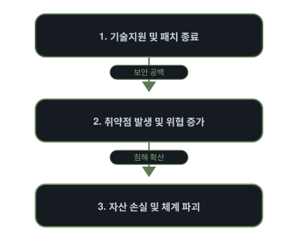
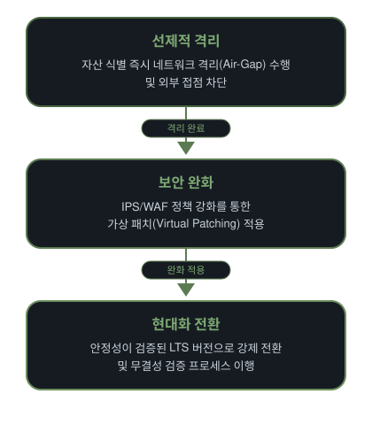

  

  

  
  
  
  

---

<h2 align="center">⚠️ WARNING: END OF SERVICE</h2>

  <strong>EOS(End of Service)</strong>는 단순한 중단을 넘어, 
  시스템의 <b>수명이 종료</b>되었음을 의미합니다.

  <i>"보안 패치가 없는 EOS 시스템 운용은 
  의도적인 보안 무력화이자 관리 부실의 증거입니다."</i>

---

<h3 align="center">EOS 취약점 연쇄 체인</h3>

  

---

<h3 align="center">EOS 대응 방법 (SOP)</h3>

  

---

  <b>서비스별 EOS 타임라인 데이터베이스</b>  
   
  위 배너를 클릭하여 기술 지원 종료 일정을 확인하세요.

