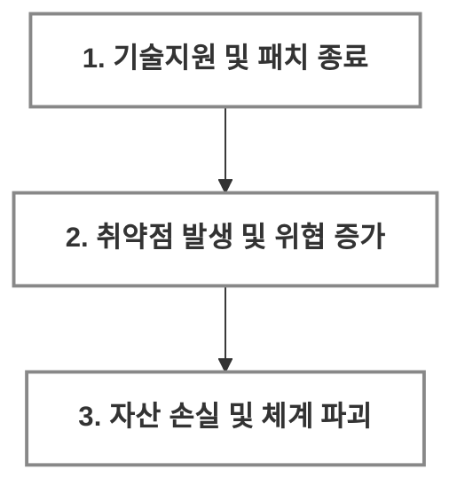

  

  

  <a href="https://www.ncsc.go.kr/"><b>[NCSC]</b></a> | 
  <a href="https://www.privacy.go.kr/"><b>[PIPC]</b></a> | 
  <a href="https://www.boho.or.kr/"><b>[KISA]</b></a> | 
  <a href="https://ctas.krcert.or.kr/"><b>[C-TAS]</b></a>
   
  <small>클릭 시 해당 사이트로 연결됩니다.</small>

 

  <h2>⚠️ [WARNING]: END OF SERVICE</h2>
  

    <strong>EOS(End of Service)</strong>는 단순한 중단을 넘어, 시스템의 <b>수명이 종료</b>되었음을 의미합니다.
  

  <blockquote style="padding: 10px;">
    "보안 패치가 없는 EOS 시스템 운용은  의도적인 보안 무력화이자 관리 부실의 증거입니다."
  </blockquote>

 

  <table width="100%" style="max-width: 800px; border-collapse: collapse; border-spacing: 0; font-family: sans-serif;">
    <thead>
      <tr>
        <th style="padding: 18px; text-align: center;">
          <strong style="font-size: 18px;">EOS 대응 방법 (SOP)</strong>
        </th>
      </tr>
    </thead>
    <tbody>
      <tr>
        <td align="center" style="padding: 22px 15px;">
          
<b>선제적 격리</b>

          
자산 식별 즉시 <b>네트워크 격리(Air-Gap)</b> 수행 및 외부 접점 차단

        </td>
      </tr>
      <tr>
        <td align="center" style="padding: 22px 15px;">
          
<b>보안 완화</b>

          
패치 불가 시 <b>IPS/WAF</b> 정책 강화를 통한 가상 패치(Virtual Patching) 적용

        </td>
      </tr>
      <tr>
        <td align="center" style="padding: 22px 15px;">
          
<b>현대화 전환</b>

          
안정성이 검증된 <b>LTS 버전</b>으로 강제 전환 및 무결성 검증 프로세스 이행

        </td>
      </tr>
    </tbody>
  </table>

 

 
<b>서비스별 EOS 타임라인 데이터베이스</b>
 

<small>위 배너를 클릭하여 기술 지원 종료 일정을 확인하세요.</small> 

